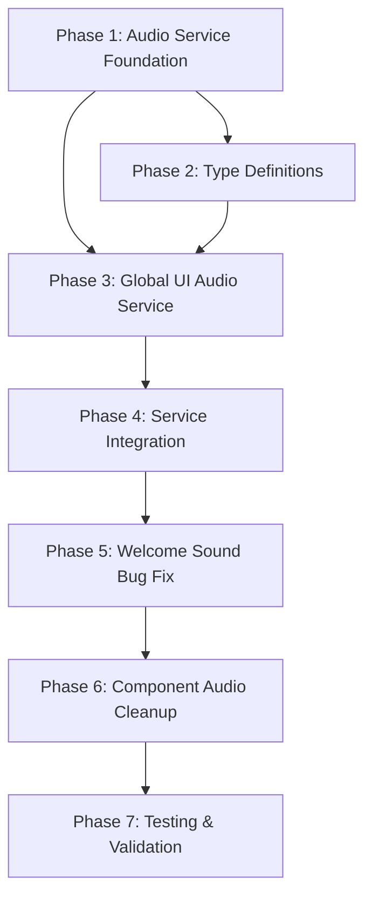

# Global UI Audio Service Implementation Plan
## Centralized Sound System for All User Interactions

This document outlines the complete implementation plan for a centralized Global UI Audio Service that automatically provides audio feedback for all user interface interactions without requiring individual component modifications.

---

## 📊 Work Progression Tracking Table

| Phase | Priority | Status | Description | Estimated Complexity | Dependencies |
|-------|----------|---------|-------------|---------------------|--------------|
| **Phase 1** | 🔴 Critical | ⚪ Pending | Audio Service Foundation | Low | None |
| **Phase 2** | 🔴 Critical | ⚪ Pending | Type Definitions & Interfaces | Low | Phase 1 |
| **Phase 3** | 🔴 Critical | ⚪ Pending | Global UI Audio Service | Medium | Phase 1, 2 |
| **Phase 4** | 🟡 High | ⚪ Pending | Service Integration & Initialization | Low | Phase 1, 2, 3 |
| **Phase 5** | 🟡 High | ⚪ Pending | Welcome Sound Bug Fix | Low | Phase 1, 2, 3, 4 |
| **Phase 6** | 🟢 Medium | ⚪ Pending | Component Audio Cleanup | Low | All Previous |
| **Phase 7** | 🟢 Medium | ⚪ Pending | Testing & Validation | Medium | All Previous |

**Status Legend:** ⚪ Pending | 🟡 In Progress | ✅ Complete | ❌ Blocked

---

## 🎯 Project Overview

### Problem Statement
Currently, audio feedback is scattered across components with inconsistent implementation:
- Tab clicks play welcome sound due to bug
- Menu button uses incorrect sound type 
- No centralized control over UI interaction sounds
- Manual integration required in each component

### Solution Architecture
Implement a **Global UI Audio Service** that:
- Automatically detects all UI interactions via event delegation
- Provides consistent audio feedback without component modifications
- Centralizes sound type management and user preferences
- Integrates seamlessly with existing audio architecture

### Key Design Principles
- **Single Responsibility Principle (SRP)**: Each service handles one specific audio concern
- **DRY Principle**: No duplicate audio integration code across components
- **Separation of Concerns**: UI interaction detection separate from audio playback
- **Zero Breaking Changes**: Existing functionality preserved throughout implementation

---

## 📁 Final File Structure

```
src/
├── services/
│   ├── audioService.ts                     # 🔄 Modified (add UI click sound)
│   ├── globalUIAudioService.ts             # 🆕 New (main service)
│   └── globalUIAudio-singleton.ts          # 🆕 New (singleton management)
├── types/
│   ├── audio/
│   │   ├── ui-audio.types.ts               # 🆕 New (UI audio types)
│   │   └── global-audio.types.ts           # 🆕 New (service types)
│   └── index.ts                            # 🔄 Modified (export new types)
├── hooks/
│   └── useGlobalUIAudio.ts                 # 🆕 New (React integration hook)
├── utils/
│   └── audio/
│       ├── elementSelectors.ts             # 🆕 New (UI element detection)
│       └── soundMapping.ts                 # 🆕 New (interaction → sound mapping)
├── App.tsx                                 # 🔄 Modified (service initialization)
└── components/
    ├── layout/
    │   ├── TabBar.tsx                      # 🔄 Modified (remove manual audio)
    │   ├── MenuButton.tsx                  # 🔄 Modified (remove manual audio)
    │   └── MenuDropdown.tsx                # 🔄 Modified (remove manual audio)
    └── [other components remain unchanged]
```

---

## 🏗️ Implementation Phases

### Phase 1: Audio Service Foundation
**Priority:** 🔴 Critical  
**Objective:** Extend existing audio service to support UI interaction sounds

#### Files to Modify:
- **`/src/services/audioService.ts`**
  - Add `uiClick` sound type to `SoundEffect` enum
  - Add `playUIClick()` method to service class
  - Add `playUIClick()` to `useChessAudio()` hook
  - Update sound definitions with UI click sound configuration

#### Integration Points (Used but not modified):
- **`/public/sounds/`** - Audio files directory (may need `ui-click.mp3`)
- **Existing audio service patterns** - Follow established sound loading patterns

#### Technical Requirements:
- Add UI interaction sound that's distinct from chess move sounds
- Ensure sound respects existing `uiSounds` setting toggle
- Maintain backward compatibility with all existing audio methods

#### Acceptance Criteria:
- ✅ `playUIClick()` method available in `useChessAudio()` hook
- ✅ UI click sound loads correctly (file or generated fallback)
- ✅ Sound respects user's `uiSounds` preference setting
- ✅ Zero breaking changes to existing audio functionality

---

### Phase 2: Type Definitions & Interfaces  
**Priority:** 🔴 Critical  
**Objective:** Define TypeScript interfaces for global UI audio system

#### Files to Create:
- **`/src/types/audio/ui-audio.types.ts`**
```typescript
// UI interaction types and sound mapping interfaces
export type UIInteractionType = 'click' | 'hover' | 'focus' | 'select'
export type UISoundType = 'uiClick' | 'uiHover' | 'uiSelect' | 'uiError'

export interface UIInteractionConfig {
  readonly interactionType: UIInteractionType
  readonly soundType: UISoundType
  readonly enabled: boolean
}

export interface UIElementSelector {
  readonly selector: string
  readonly interactionType: UIInteractionType
  readonly priority: number
}
```

- **`/src/types/audio/global-audio.types.ts`**
```typescript
// Service configuration and lifecycle types
export interface GlobalUIAudioConfig {
  readonly enabled: boolean
  readonly autoDetection: boolean
  readonly customSelectors: UIElementSelector[]
  readonly excludeSelectors: string[]
}

export interface GlobalUIAudioService {
  initialize(): void
  destroy(): void
  configure(config: Partial<GlobalUIAudioConfig>): void
  addCustomSelector(selector: UIElementSelector): void
  removeCustomSelector(selectorString: string): void
}
```

#### Files to Modify:
- **`/src/types/index.ts`**
  - Export all new audio types for easy importing

#### Integration Points:
- **`/src/services/audioService.ts`** - Uses `UISoundType` enum
- **Existing type patterns** - Follow established type organization

#### Technical Requirements:
- Comprehensive type coverage for all UI interaction scenarios
- Extensible interfaces that allow future sound type additions
- Integration with existing audio service type patterns

#### Acceptance Criteria:
- ✅ All UI audio types properly defined and exported
- ✅ Service interfaces support configuration and lifecycle management
- ✅ Types integrate cleanly with existing audio service types
- ✅ Full TypeScript IntelliSense support for new types

---

### Phase 3: Global UI Audio Service
**Priority:** 🔴 Critical  
**Objective:** Implement the core global UI audio detection and playback service

#### Files to Create:
- **`/src/services/globalUIAudioService.ts`**
  - Main service class with event delegation
  - Element detection logic for buttons, tabs, interactive elements
  - Integration with existing `ChessAudioService`
  - Configuration management and user preferences

- **`/src/services/globalUIAudio-singleton.ts`**
  - HMR-safe singleton pattern following existing `stockfish-singleton.ts`
  - Development vs production lifecycle management
  - Service instance management and cleanup

#### Files to Create (Supporting Utilities):
- **`/src/utils/audio/elementSelectors.ts`**
```typescript
// Pre-defined selectors for common UI elements
export const DEFAULT_UI_SELECTORS: UIElementSelector[] = [
  { selector: 'button', interactionType: 'click', priority: 10 },
  { selector: '[role="button"]', interactionType: 'click', priority: 10 },
  { selector: '[role="tab"]', interactionType: 'click', priority: 15 },
  { selector: '.clickable', interactionType: 'click', priority: 5 },
  { selector: 'a[href]', interactionType: 'click', priority: 8 }
]
```

- **`/src/utils/audio/soundMapping.ts`**
```typescript
// Maps UI interaction types to specific sounds
export const UI_SOUND_MAPPING: Record<UIInteractionType, UISoundType> = {
  click: 'uiClick',
  hover: 'uiHover', 
  focus: 'uiSelect',
  select: 'uiSelect'
}
```

#### Integration Points:
- **`/src/services/audioService.ts`** - Uses `ChessAudioService` instance
- **Phase 1 & 2** - Depends on audio service extension and type definitions
- **Browser Event System** - Uses `addEventListener` on document
- **Existing singleton patterns** - Follows `stockfish-singleton.ts` approach

#### Technical Requirements:
- Event delegation from document root for performance
- Smart element detection that handles nested clickable elements
- Configurable exclude/include selector system
- Proper cleanup and memory management
- Integration with existing audio service settings

#### Service Architecture:
```typescript
class GlobalUIAudioService {
  // Core functionality
  initialize(): void
  destroy(): void
  
  // Event handling
  private handleGlobalClick(event: Event): void
  private shouldPlaySoundForElement(element: Element): boolean
  
  // Configuration
  configure(config: Partial<GlobalUIAudioConfig>): void
  
  // Integration
  private getAudioService(): ChessAudioService
}
```

#### Acceptance Criteria:
- ✅ Service detects clicks on all standard UI elements (buttons, tabs, links)
- ✅ Proper integration with existing `ChessAudioService`
- ✅ Configurable element detection with custom selectors
- ✅ HMR-safe singleton pattern for development
- ✅ No memory leaks or event listener buildup
- ✅ Performance optimized event delegation

---

### Phase 4: Service Integration & Initialization
**Priority:** 🟡 High  
**Objective:** Integrate global UI audio service into application lifecycle

#### Files to Create:
- **`/src/hooks/useGlobalUIAudio.ts`**
```typescript
// React hook for service integration
export function useGlobalUIAudio(config?: Partial<GlobalUIAudioConfig>) {
  const audioService = getGlobalUIAudioService()
  
  useEffect(() => {
    audioService.initialize()
    if (config) {
      audioService.configure(config)  
    }
    
    return () => {
      // Development cleanup handled by singleton
    }
  }, [config])
  
  return {
    configure: audioService.configure,
    addCustomSelector: audioService.addCustomSelector,
    removeCustomSelector: audioService.removeCustomSelector
  }
}
```

#### Files to Modify:
- **`/src/App.tsx`**
  - Import and initialize `useGlobalUIAudio()` hook
  - Place initialization in `AppContent` component (after audio system ready)
  - Configure service with application-specific settings

#### Integration Points:
- **Phase 1-3** - All previous phase deliverables
- **`/src/services/audioService.ts`** - Uses existing audio service
- **React component lifecycle** - Integrates with `useEffect` patterns
- **Application startup sequence** - Initializes after audio system ready

#### Technical Requirements:
- Service initializes automatically on application start
- Proper integration with React component lifecycle
- Configuration options available for different application areas
- Service remains active throughout application lifetime

#### Implementation Strategy:
```typescript
// In App.tsx AppContent component
function AppContent() {
  const { preloadSounds, playGameStart } = useChessAudio()
  
  // Initialize global UI audio after audio system is ready
  useGlobalUIAudio({
    enabled: true,
    autoDetection: true,
    excludeSelectors: ['[data-no-sound]', '.chess-piece'] // Exclude game pieces
  })
  
  // ... rest of component
}
```

#### Acceptance Criteria:
- ✅ Service automatically initializes on application startup
- ✅ Hook provides configuration options for different use cases
- ✅ Integration respects existing audio system initialization sequence
- ✅ Service lifecycle properly managed with React patterns
- ✅ Configuration persists throughout application session

---

### Phase 5: Welcome Sound Bug Fix  
**Priority:** 🟡 High  
**Objective:** Fix the welcome sound playing on every tab click while maintaining global UI audio

#### Files to Modify:
- **`/src/App.tsx`**
  - Fix the `useEffect` dependency array issue causing welcome sound repetition
  - Ensure global UI audio works correctly with fixed welcome sound logic
  - Implement proper "first interaction" detection

#### Integration Points:
- **Phase 4** - Global UI audio service must be initialized
- **Existing welcome sound logic** - Must preserve intended behavior
- **`/src/services/audioService.ts`** - Uses existing `playGameStart()` method

#### Technical Requirements:
- Welcome sound plays **only once** on first user interaction
- Global UI audio service provides consistent click sounds after welcome sound
- No interference between welcome sound and UI click sounds
- Proper event listener lifecycle management

#### Implementation Strategy:
```typescript
// Fix useEffect dependencies and logic
useEffect(() => {
  const handleFirstInteraction = () => {
    console.log('🎵 [APP] ACTUAL first user interaction - initializing audio system');
    preloadSounds();
    playGameStart(); // Welcome sound
    
    // Remove listeners after first interaction
    document.removeEventListener('click', handleFirstInteraction);
    document.removeEventListener('keydown', handleFirstInteraction);
  };

  document.addEventListener('click', handleFirstInteraction, { once: true });
  document.addEventListener('keydown', handleFirstInteraction, { once: true });
  
  return () => {
    document.removeEventListener('click', handleFirstInteraction);
    document.removeEventListener('keydown', handleFirstInteraction);
  };
}, []) // Empty dependency array - run only on mount
```

#### Acceptance Criteria:
- ✅ Welcome sound plays exactly once on first user interaction
- ✅ Subsequent interactions play appropriate UI click sounds
- ✅ No repetitive welcome sound on tab switches
- ✅ Global UI audio service functions correctly after welcome sound
- ✅ Console logging confirms single audio system initialization

---

### Phase 6: Component Audio Cleanup
**Priority:** 🟢 Medium  
**Objective:** Remove manual audio integration from components now handled by global service

#### Files to Modify:
- **`/src/components/layout/MenuButton.tsx`**
  - Remove `useChessAudio()` import and `playMove()` calls
  - Simplify `handleMenuClick` to only handle menu state
  - Let global service handle click audio automatically

- **`/src/components/layout/MenuDropdown.tsx`**  
  - Remove `useChessAudio()` integration from menu items
  - Simplify click handlers to only perform actions
  - Let global service handle click audio automatically

- **`/src/components/layout/TabBar.tsx`**
  - Remove any manual audio integration (if added during testing)
  - Ensure tab buttons work correctly with global audio service
  - Remove logging added for investigation (optional)

#### Integration Points:
- **Phase 3-5** - Global UI audio service must be fully functional
- **Component state management** - Preserve all non-audio functionality
- **Event handling** - Ensure click handlers still work correctly

#### Technical Requirements:
- All existing component functionality preserved
- Click handlers simplified to only handle business logic
- Audio feedback automatically provided by global service
- No breaking changes to component APIs

#### Cleanup Strategy:
```typescript
// Before (Manual Audio Integration):
const handleMenuClick = () => {
  playMove(false) // Remove this
  toggleMenu()    // Keep this
}

// After (Global Service Handles Audio):
const handleMenuClick = () => {
  toggleMenu()    // Only business logic remains
}
```

#### Acceptance Criteria:
- ✅ Manual audio calls removed from all layout components
- ✅ Component functionality unchanged (only audio handling removed)
- ✅ Global service provides audio for all component interactions
- ✅ Click handlers simplified and focused on single responsibility
- ✅ No duplicate audio playing (global service + manual calls)

---

### Phase 7: Testing & Validation
**Priority:** 🟢 Medium  
**Objective:** Comprehensive testing of global UI audio system across all components

#### Testing Categories:

**1. Functional Testing:**
- All button types play appropriate UI sounds
- Tab switching has consistent audio feedback
- Menu interactions work correctly
- Welcome sound plays only once per session

**2. Edge Case Testing:**
- Nested clickable elements (button inside button)
- Disabled buttons (should not play sounds)
- Elements with `[data-no-sound]` attribute
- Rapid clicking scenarios

**3. Performance Testing:**
- Event listener performance under load
- Memory usage during extended use
- Service cleanup on component unmount

**4. Browser Compatibility:**
- Audio works across different browsers
- Event delegation compatibility
- AudioContext initialization timing

#### Files for Testing Support:
- **Testing utilities** (if needed)
- **Console logging** (temporary for validation)
- **Configuration testing** (different service settings)

#### Integration Points:
- **All previous phases** - Complete system must be functional
- **Existing test infrastructure** - Use established testing patterns
- **Manual testing protocols** - Real user interaction testing

#### Testing Protocol:
```
1. Fresh page load:
   - First click → Welcome sound + UI click sound
   - Subsequent clicks → Only UI click sounds

2. Tab navigation:
   - Each tab click → Single UI click sound
   - No welcome sound repetition

3. Menu system:
   - Menu button → UI click sound
   - Menu items → UI click sounds
   - Menu close → No duplicate sounds

4. Component interactions:
   - All buttons respond with appropriate sounds
   - Custom elements with role="button" work
   - Disabled elements stay silent

5. Configuration testing:
   - Disable UI sounds → No click sounds
   - Custom selectors → Work correctly
   - Exclude selectors → Elements stay silent
```

#### Acceptance Criteria:
- ✅ All UI interactions provide consistent audio feedback
- ✅ Welcome sound bug completely resolved (plays only once)
- ✅ No performance degradation from global event listening
- ✅ Service configuration options work as expected
- ✅ Manual testing confirms excellent user experience
- ✅ No console errors or memory leaks detected

---

---

## 🔗 Inter-Phase Dependencies



**Critical Path:** Phases 1-5 must be completed in order  
**Parallel Work:** Phases 6-7 can be worked on simultaneously after Phase 5  
**Dependencies:** Each phase builds on previous foundations without breaking changes

---

## 🏆 Success Criteria

**Technical Success:**
- ✅ All UI interactions provide consistent audio feedback
- ✅ Zero component modifications required for new buttons
- ✅ Centralized configuration and control
- ✅ Performance optimized event delegation
- ✅ Welcome sound bug completely resolved

**User Experience Success:**
- ✅ Professional, consistent audio feedback across application
- ✅ Configurable audio preferences (users can disable UI sounds)
- ✅ No audio conflicts or duplicate sounds
- ✅ Responsive audio that enhances interaction feel

**Maintainability Success:**
- ✅ DRY principle - no scattered audio integration code
- ✅ SRP principle - each service handles specific audio concerns
- ✅ Easily configurable and extensible for future needs
- ✅ Clear documentation for future development

**Architecture Success:**
- ✅ Follows established codebase patterns and conventions
- ✅ Integrates seamlessly with existing audio service
- ✅ Maintains backward compatibility throughout implementation
- ✅ Provides foundation for future audio enhancements

---

## 📋 Implementation Notes

**Phase Sizing Philosophy:**
Each phase is designed to be completable in a single focused work session, with clear deliverables and acceptance criteria. Phases are ordered by dependency and priority to ensure a smooth implementation flow.

**SRP & DRY Adherence:**
- **Audio Service Foundation (Phase 1)**: Single responsibility for sound playback
- **Type Definitions (Phase 2)**: Single responsibility for type contracts  
- **Global UI Service (Phase 3)**: Single responsibility for UI interaction detection
- **Integration (Phase 4)**: Single responsibility for React lifecycle management
- **No Duplication**: Eliminates scattered audio integration code across components

**Quality Assurance:**
Each phase includes specific acceptance criteria that must be met before proceeding to the next phase. This ensures cumulative quality and prevents architectural issues from compounding.

This implementation plan provides a clear roadmap for creating a robust, centralized UI audio system that enhances user experience while maintaining clean, maintainable code architecture.